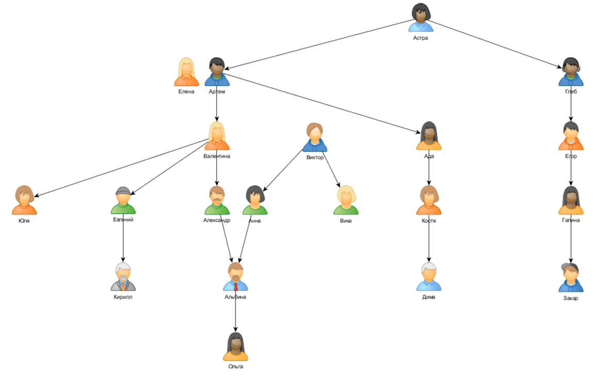
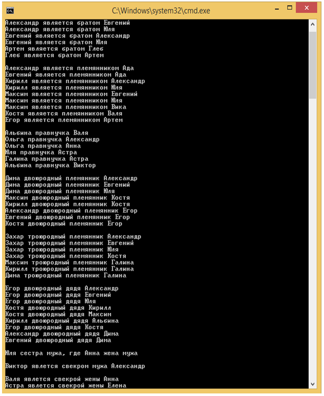

# Использование языка логики Prolog
<h1>Содержание</h1>
  <ul>
    <li><a href="#task">Задача</a></li>
    <li><a href="#tree">Генеологическое дерево</a></li>
    <li><a href="#result">Результат работы программы</a></li>
    <li><a href="#experience">Полученный мною опыт</a></li>
  </ul>
<h2 id="task">Задача</h2>

  Реализовать средствами языка Visual Prolog базу знаний «родственные отношения».

  Найти:
  <ul>
    <li>брата;</li>
    <li>правнука;</li>
    <li>двоюродного дядю;</li>
    <li>троюродного племянника;</li>
    <li>своячнецу;</li>
    <li>золовку;</li>
  </ul>
  А также:
  <ul>
    <li>свекровь;</li>
    <li>свекра;</li>
  </ul>

Задать Prolog-программе вопросы, касающиеся представленных родственных отношений, следующих типов.

  <ul>
    <li>"Находится ли субъект "а" в отношении "R" с субъектом "b";</li>
    <li>"Является ли субъект "a" родственником типа "R" для субъекта "b" [вопрос типа R(a,b)];</li>
    <li>"Является ли субъект "b" родственником типа "R" для субъекта "a" [вопрос типа R(b,a)];"</li>
    <li>"Кто находится в отношении "R" с субъектом "a";</li>
    <li>"Найти всех субъектов, для которых "a" является родственником типа "R" [вопрос типа R(a,X)];</li>
    <li>"Найти всех субъектов, которые являются родственниками типа "R" для субъекта "b" [вопрос типа R(Y,b)];</li>
    <li>"Найти все пары субъектов, находящихся в отношении "R" [вопрос типа R(X,Y)].</li>
  </ul>

<h2 id="tree">Генеологическое дерево</h2>

  

<h2 id="result">Результат работы программы</h2>

  

<h2 id="experience">Полученный мною опыт</h2>
  <ul>
    <li>Опыт работы с языком логики Prolog в среде Visual Prolog;</li>
    <li>С помощью Prolog осуществил поиск родственников по генеологическому дереву;</li>
    <li>Узнал существование некторых родственников :)</li>
  </ul
